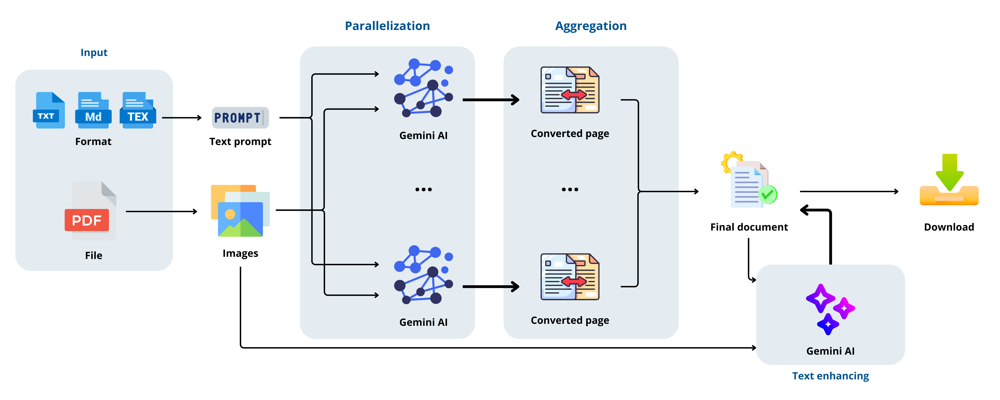

# Plūma: Scripta Volant, Digital Manen
Plūma is an innovative solution designed to address the challenge of managing and **digitizing handwritten notes** in business and educational contexts. In an age where digitization is key to operational efficiency and information management, Plūma transforms handwritten notes into digital formats with high **accuracy** and **ease**. The introduction outlines the need for such a solution, highlighting benefits like improved accessibility, simplified sharing, secure archiving, and enhanced operational efficiency.

The application workflow is detailed, showcasing features such as notes upload, **text recognition** via the advanced _Gemini LLM model_, text conversion into various digital formats, and an AI-driven note **enhancement feature** that enriches the digitized content by correcting semantic errors and expanding on transcribed concepts.

## Workflow

## More details
For more details, please refer to the [documentation](Documentation.pdf).
